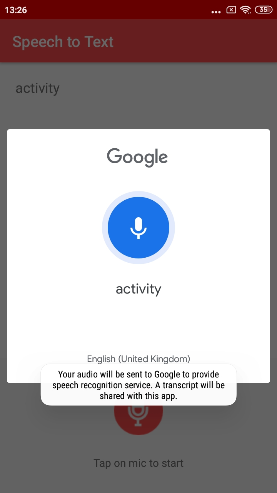

# SpeechToOpenActivity
In this video the activity will be open with speech , When you speech activity the next activity will be open

    It will do it through RecognizerIntent.
    You do not require any internet connection to use the voice to text service. 
    It will work in Offline mode.

#### Condtion

    if (mVoiceInputTv.getText().toString().equals("activity"))
         {
           Intent intent = new Intent(getApplicationContext(),NewActivity.class);
           startActivity(intent);
         }

 &nbsp; 
